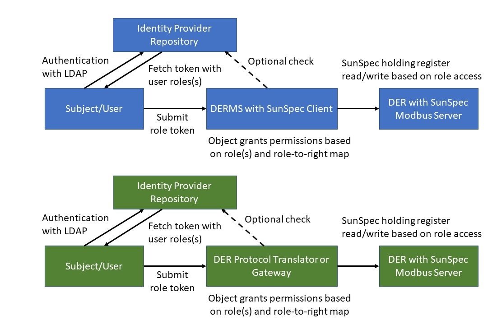

# SunSpec Role-Based Access Control
This code presents a client-side implementation of role-based access control (RBAC) for the 700-series SunSpec Modbus models. The [add\_rbac.py](./add_rbac.py) script duplicates the SunSpec json models from [json/](./json) and puts them in [rbac\_json/](./rbac_json).

For more details on the DER RBAC and the role-to-rights mapping, please see [Recommendations for Distributed Energy Resource Access Control](https://www.researchgate.net/publication/348849559_Recommendations_for_Distributed_Energy_Resource_Access_Control).

## Applicability
While the role-to-rights mapping for RBAC implementations typically would exist at the DER object,  [rbac\_der\_demo.py](./rbac_der_demo.py) demonstrates a client-side Modbus RBAC implementation.  In fielded deployments, it is likely better to pass the cryptographic role token to the DER in order to authorize the user to read/write specific holding registers. 

However, this approach could be useful in a couple situations:

* This could be used to create an RBAC in a DERMS  before passing Modbus commands down to the DER devices.
* This could be used in protocol translators/gateways that take IEEE 2030.5 or proprietary protocols and then interact with DER Modbus servers.

[rbac\_der\_demo.py](./rbac_der_demo.py) creates a *read_inv* and *write_inv* pysunspec2.file.client.FileClientDevice objects and then removes the pysunspec2 points that are not associated with the read/write actions using the RBAC role permissions in rbac_jason.  

## Demonstration
To provide a simple demonstration of this technology, the following roles 

>     rbac_roles = [
        'der_owner',
        'installer',
        'der_vendor_or_service_provider',
        '3rd_party_or_aggregator',
        'utility_or_dso',
        'iso_rto_tso',
        'security_administrator',
        'security_auditor',
        'rbac_administrator',
    ]

request to read and write four SunSpec points/curves:

* common[0].Md
* DERCapacity[0].WMaxRtg
* DERCapacity[0].VMax
* DERVoltVar[0].Crv[0].Pt[i].V/Var

The results indicate the the roles are appropriately constrained and cannot read/write SunSpec points for which they are not authorized.  

## Future Work
It would be nice to have a single python object that manages all the read/write actions of the RBAC-constrained DER. Any takers?
